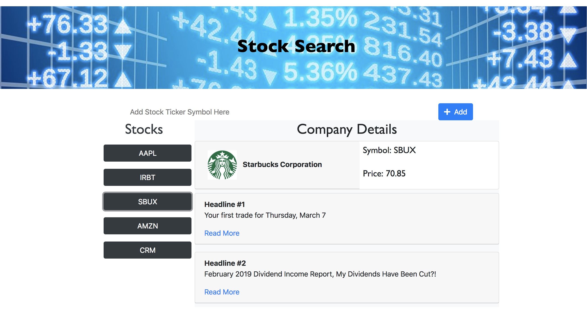

# Stock-Search
============

Stock-Search is a stock information search application.  It helps you quickly find the latest quote (price) and news for your **favorite** publically traded stocks. 

Stock-Search uses the iexTrading API [iexTrading API](https://iextrading.com/developer/docs/#stocks) to surface details about your favorite stocks.

